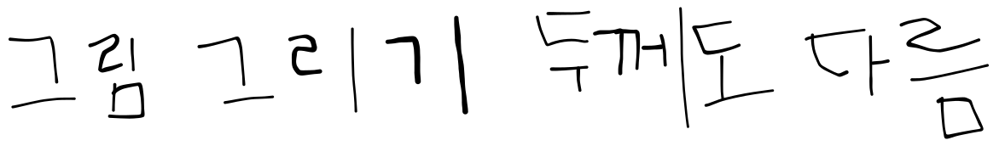

# new-space-1

## 제목

### 부제목1

* 내용1
* 내용2
  * 내용2-1
  * 내용2-2
* 내용3


### 부제목2

#### 부제목3


\#### 부제목4

\##### 부제목5


1. 1번
2. 2번
3. 3번

* [ ] 체크박스1
  * [ ] 체크박스2


:clap:


$$f(x) = x * e^{2 pi i \xi x}$$


***


\---

\--------------

\-----------------------


> 안녕하세요



힌트 기능



```
// Some code
코드블록1
```


````
``` + 엔터만 입력해도 자동으로 코드 블록

````

```python
import python

형식 지정 가능
```


|                      |   |   |
| -------------------- | - | - |
| 자동 표 생성              |   |   |
| 자ㅇ로 표 생ㅇ             |   |   |
| 자ㅇ로 표 생ㅓㅇ            |   |   |
| hello world          |   |   |
| 표에 한ㅡ 입력ㅣ 제로 되지 ㅇㅎㅡㅁ |   |   |


표에서만 안되는건가 평문 입력 시에는 크게 문제는 없으나 엔터가 글 입력 후 엔터를 두번 눌러야 줄바꿈이 되는구나 아니면 문장 부호를 입력하면 줄바꿈이 되는구나!


hello! english

is possible

haha

...


<table data-view="cards"><thead><tr><th></th><th></th><th></th></tr></thead><tbody><tr><td></td><td>카 기ㅇ</td><td>card</td></tr><tr><td>card2</td><td>card2</td><td>card2</td></tr><tr><td>card3</td><td></td><td></td></tr><tr><td></td><td></td><td></td></tr></tbody></table>




this is tab.

이건 탭 입니다.

탭에서는 글이 씹히지는 않고 평문과 같습니다.




<details>

<summary>title</summary>


</details>




















* 이미지 추

&#x20;
